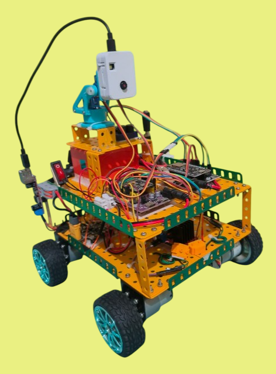
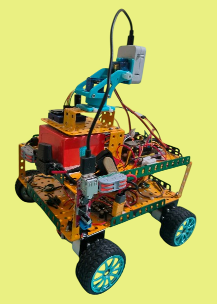
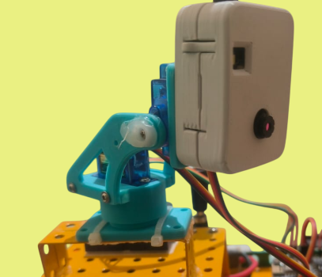

# Hazard Detection Robot - Master Repository

This is the **master repository** for the **Hazard Detection Robot** project.  
It links four individual components that work together:

- [ESP32 Robot Code](https://github.com/jithangowda/ESP-Robot.git)
- [ESP8266 Robot Code](https://github.com/jithangowda/ESP-8266-Robot.git)
- [ESP32-CAM Code](https://github.com/jithangowda/ESP-CAM-Robot.git)
- [Flask Server Code](https://github.com/jithangowda/Flask-Robot.git)

Each of these components has its own repository, and the **master repo** is only for linking them together.

**To get started:**  
Clone each repository individually and follow its respective `README.md` for setup and usage instructions.

---

  
  
  

